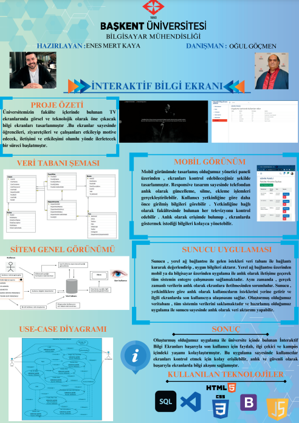

Bu projede, genel olarak fakültemizin belirli yerlerine konumlandırılmış ekranlarda
öğretim elemanları, öğrenciler, çalışan ve ziyaretçiler için güncel, hızlı ve interaktif bir
şekilde bilgi akış ekranı tasarlanmıştır. Anlık ve hızlı bilgi akışının yanında oryantasyon
oyunları, etkinlik haberleri, özel gün kutlamaları, doğal afet ve acil durumlar anında
anlık tahliye ve bilgilendirme aracı olarak da kullanılabilir.

### 1-Admin/Yönetici Rolü 

* :ear: ​**Kullanıcı İşlemleri :** Yönetici **Interaktif Bilgi Ekranı** aracılığı ile kullanıcı ekleyebilir, silebilir.Admin rolüne giriş için ;
* Kullanıcı adı : admin@gmail.com  Şifre: 123
  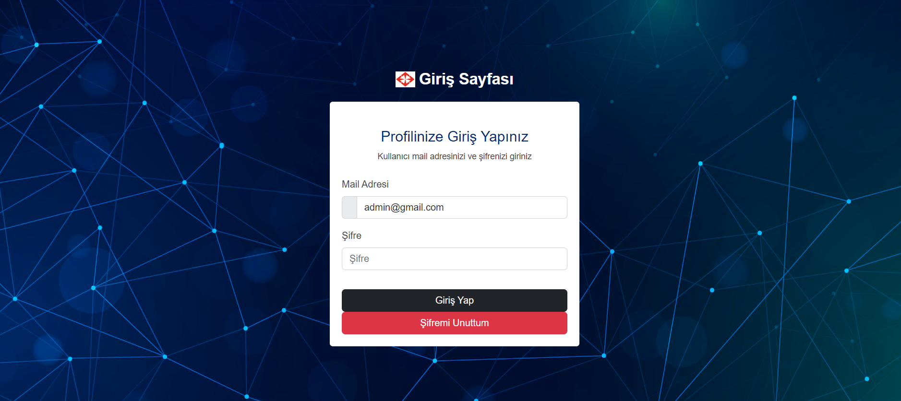
  Admin rolü ile giriş yapan kullanıcı , fakültede uygulamayı kullanmak isteyen kişileri oluşturup silme yetkisi vardır.İstenilen fakültede yetkili kişiyi oluşturup default bir şifre atar. Kullanıcılar kayıt oldukları mail adreslerine yeni şifre talebi gönderebilir. Şifreler mssql database üzerinden md-5 ile kriptolanmış bir şekilde tutulur.
  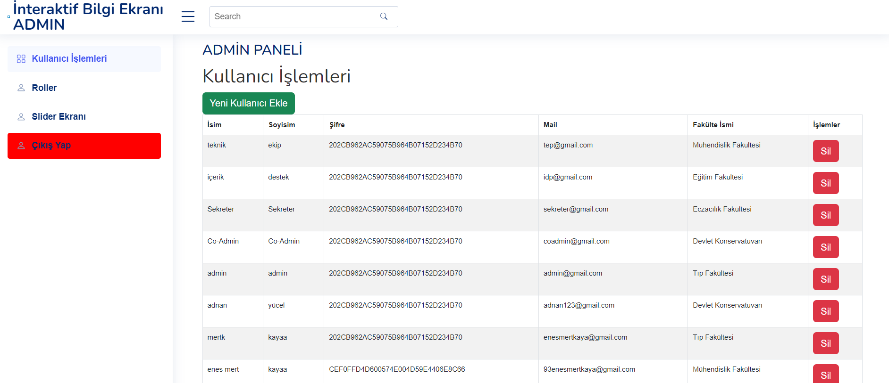
  Yeni kullanıcı ekleme ekranından fakülte ve yetkinlik seçilip yeni kullanıcı oluşturulur.
  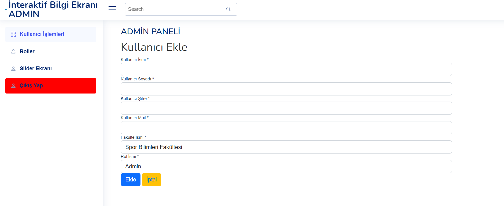
  
### 2-Co-Admin/Yardımcı Yönetici Rolü 

:house:​**Co-Admin İşlemleri  :** Yardımcı Yönetici ** Üniversite içinde yeni bölüm ekleyebilir.(Yeni bölümlerde olan ekranları kullanmak için.)
 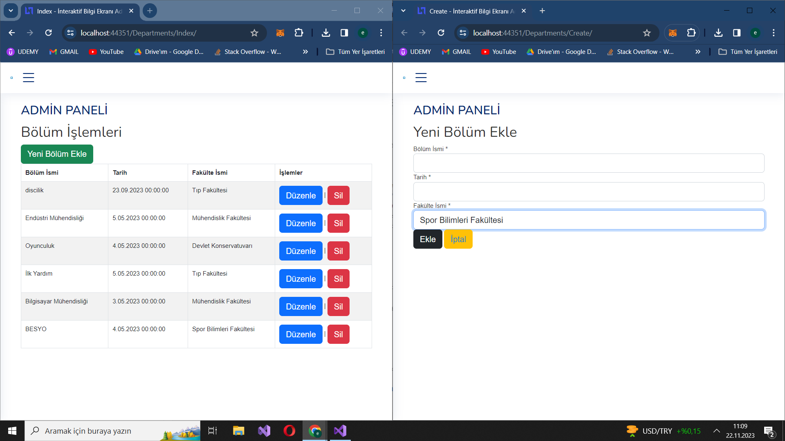
 **Yeni Fakülte oluşturabilir ;
 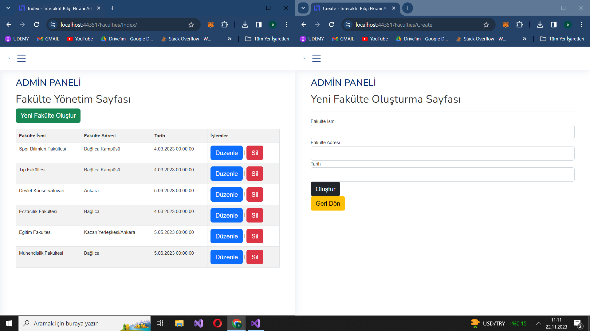
 **Yeni TV ekranları oluşturabilir.( Tv id'lerine göre haber ekleyebilmek için)
 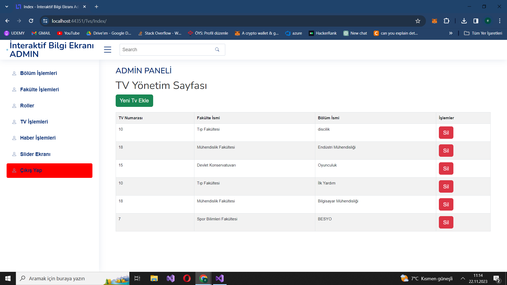
 **Ekranlarda gösterilmek üzere yeni haber , foto , bilgi girişi yapabilir.
 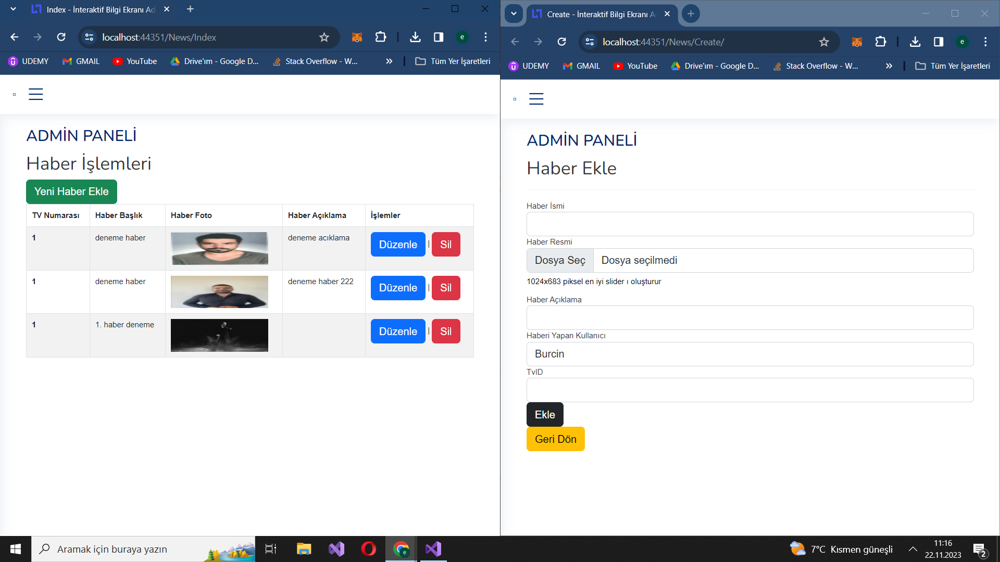
 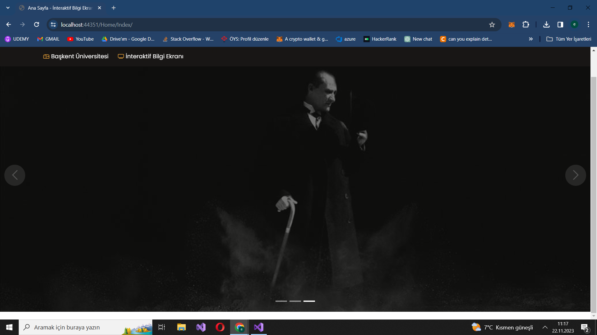
 
### 3- Kullanıcı Rolü

* :ear:: **Duyuru İşlemleri :** Kullanıcı **İnteraktif Bilgi Ekrani** aracılığı ile duyuruları görüntüleyebilir.

* :dollar: **Önemli Gün ve Etkinlikler :** Kullanıcı **İnteraktif Bilgi Ekrant** aracılığı ile etkinlik ve üniversite içinde olan etkinliklerden anlık olarak haberdar olabilir.
* :package:**Mesaj İşlemleri :** Kullanıcı **İnteraktif Bilgi Ekrant** aracılığı ile anlık olarak mesaj ve görüntü bilgisi ile bilgi aktarımı sağlayabilir.

  ## :computer: Projenin Kurulumu

   Proje’yi çalıştırmak için SQL Server Management Studio Management Studio 19’ın bilgisayarınızda yüklü olması gerekmektedir. Bu kurulumu tamamladıktan sonra veritabanlarımızın yerel sunucumuzda oluşmasını sağlamak için projemizi açıyoruz. Başlangıç projemizi **Kurumsal.Web** olarak belirledikten sonra package manager console’umuzda varsayılan projemizi **KurumsalWeb** olarak belirliyor ve **update-database** komutunu giriyoruz.Bu işlemden sonra veritabanımız yerel sunucumuz içerisinde oluşuyor.

  **Projeye Ait İlişkili Veri Tabanı ve diğer görseller ;

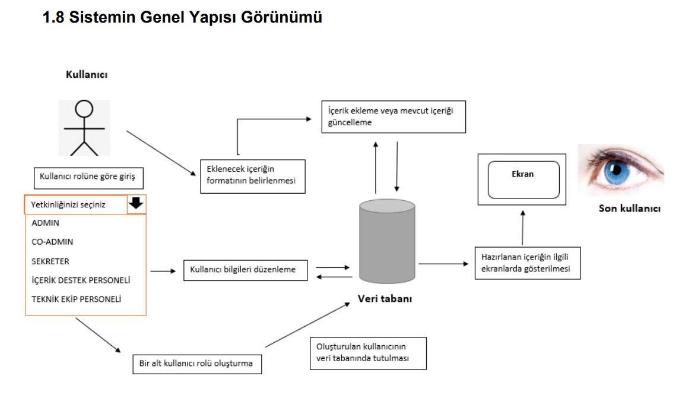
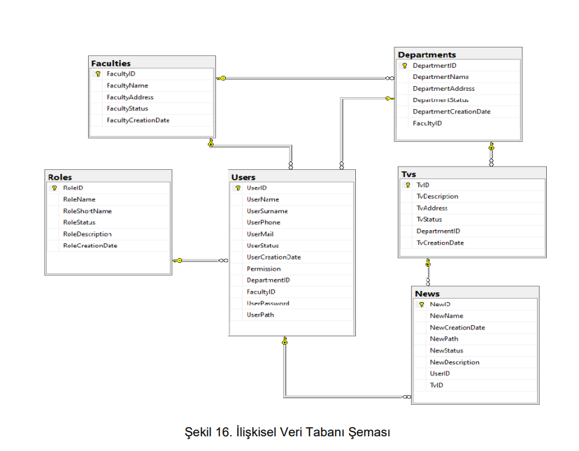
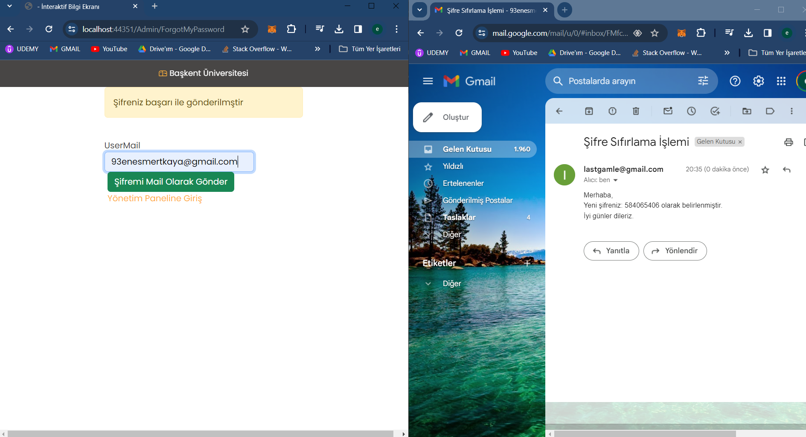
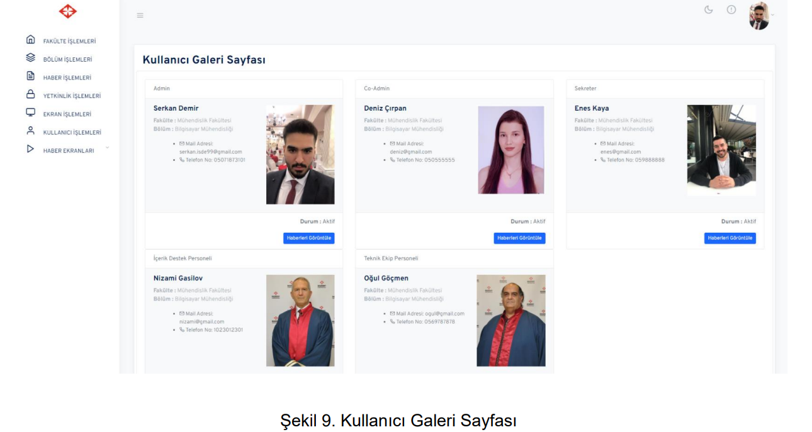
<h2> 🛠 &nbsp;Kullanılan Teknolojiler</h2>

<table style"float:right;">
  <tr>
    <td></td>
    <td></td>
    <td></td>
  </tr>
  <tr>
    <td></td>
    <td>
    <td></td>
  </tr>
  <tr>
    <td> </td>
    <td></td>
  </tr>
  <tr>
    <td></td>
 		<td></td>
    <td></td>
  </tr>
</table>

 
